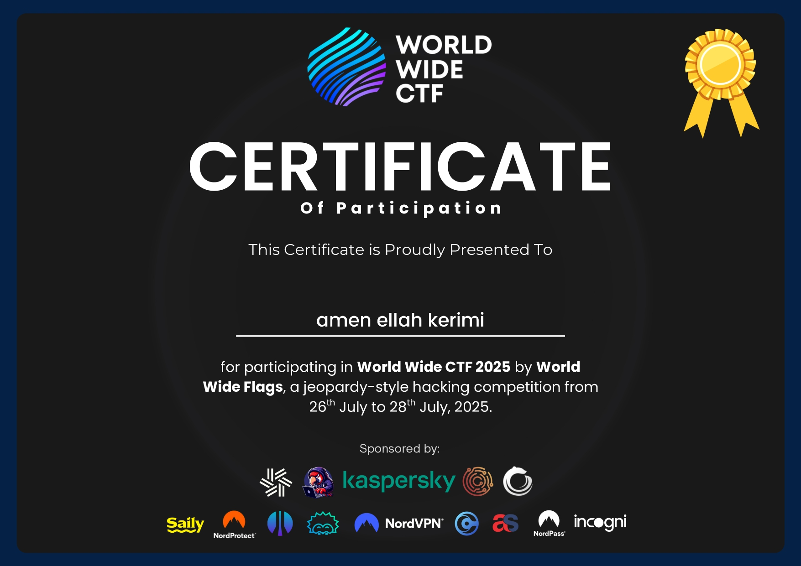

## Hi, I'm Amen Ellah ✨🗿

A passionate **Computer Engineering Student** at the Faculty of Sciences Bizerte. I'm driven by a desire to learn and build, constantly creating projects in areas like Cyber Security, AI, Web Development, Mobile Development, and IoT to refine my skills and stay consistent.

## 🌐 Socials:

---

# 💻 Tech Stack & Skills

Here's an overview of the technologies and tools I work with, categorized by field:

### 👨‍💻 Programming Languages
| Category | Languages |
|---|---|
| **Core Languages** |        |

### 🌐 Web & Mobile Development
| Category | Technologies |
|---|---|
| **Frontend & Mobile UI** |         |
| **Backend** |          |
| **Databases** |     |

### 🧠 Artificial Intelligence (AI) & Machine Learning (ML)
| Category | Technologies |
|---|---|
| **Libraries/Frameworks** |      |

### 🔒 Cybersecurity
| Category                 | Technologies & Concepts                                                                                     |
|--------------------------|-------------------------------------------------------------------------------------------------------------|
| 🔌 Protocols & Networking | TCP/IP, MQTT, TLS/SSL, ARP, DNS, HTTP/S, 802.11 (WiFi), JWT                                                 |
| 🧰 Tools & Platforms      | Nmap, Wireshark, Hydra, Metasploit, Aircrack-ng, Burp Suite, John the Ripper, Cisco Packet Tracer, Mosquitto, Nginx |
| 🧨 Attack Techniques      | ARP Spoofing, Evil Twin, Deauth, Beacon Flood, Probe Request Spam, MQTT Spoofing, Fake Broker/Device Emulation |
| 🛡️ Defensive Practices    | Strong Authentication (JWT, Username/Password), TLS Encryption, Input Validation & Sanitization, Access Control, Message Integrity (Checksums, Hashing), Secure Credential Storage |

### ☁️ DevOps & Cloud
| Category | Technologies |
|---|---|
| **Version Control** |   |
| **Containerization** |   |
| **CI/CD & Automation** |  |

### ⚙️ IoT & Embedded Systems
| Category | Technologies |
|---|---|
| **Hardware Platforms** |      |
| **Firmware Development** |  |
| **Sensors & Actuators** | DHT22, LDR, PIR Motion Sensors, LEDs, Relays |

### 📝 Productivity & Other Tools
| Category | Technologies |
|---|---|
| **Productivity** |  |
| **Hardware** |  |
| **Gaming** |  |
---
## 🚀 Projects by Field

### 🌐 Full-Stack & Web Development
| Project Name               | Description                                                                                     | Link                                                                                          |
|---------------------------|-------------------------------------------------------------------------------------------------|-----------------------------------------------------------------------------------------------|
| Web-IOT-Weather-Dashboard  | React frontend + Python Flask backend using MQTT and Chart.js to display weather sensor data.    | [Web-IOT-Weather-Dashboard](https://github.com/Amen-ellah-kerimi/Web-IOT-Weather-Dashboard)   |
| amazon-copy               | Amazon e-commerce frontend clone built with React.                                              | [amazon-copy](https://github.com/Amen-ellah-kerimi/amazon-copy)                                |
| Online_Shop_Example        | Example online shop project demonstrating fullstack concepts.                                   | [Online_Shop_Example](https://github.com/Amen-ellah-kerimi/Online_Shop_Example)                |
| Introduction_-_React       | Basic React tutorial project for learning React fundamentals.                                   | [Introduction_-_React](https://github.com/Amen-ellah-kerimi/Introduction_-_React)              |
| Portfolio-with-Tailwind-CSS| Personal portfolio site using Tailwind CSS.                                                     | [Portfolio-with-Tailwind-CSS](https://github.com/Amen-ellah-kerimi/Portfolio-with-Tailwind-CSS)|
| Project-Template          | Boilerplate template project for starting frontend development.                                 | [Project-Template](https://github.com/Amen-ellah-kerimi/Project-Template)                     |
| Quiz                      | Simple interactive quiz app.                                                                    | [Quiz](https://github.com/Amen-ellah-kerimi/Quiz)                                            |
| Egg_Timer                 | Timer app implemented in JavaScript.                                                           | [Egg_Timer](https://github.com/Amen-ellah-kerimi/Egg_Timer)                                  |
| Full Stack App             | Fullstack app with GitHub OAuth authentication, CRUD dashboard, Zod validation, deployment script for Vercel. | [Full Stack App](https://github.com/Amen-ellah-kerimi/fullstack-app)                          |
| Notes App                  | Secure notes app with Clerk authentication, PostgreSQL (Neon), Drizzle ORM, real-time sync.    | [Notes App](https://github.com/Amen-ellah-kerimi/notes-app)                                   |
| JSON Share App             | JSON editor with public URL sharing via Nanoid, secure read-only sharing system.               | [JSON Share App](https://github.com/Amen-ellah-kerimi/json-share-app)                         |
| AI Chat App                | AI assistant with streaming OpenAI GPT responses, modern responsive chat UI.                   | [AI Chat App](https://github.com/Amen-ellah-kerimi/ai-chat-app)                                |

---

### 🧰 Backend & APIs
| Project Name               | Description                                                                                     | Link                                                                                          |
|---------------------------|-------------------------------------------------------------------------------------------------|-----------------------------------------------------------------------------------------------|
| Express-Rest-API           | RESTful API built with Express.js and Node.js.                                                 | [Express-Rest-API](https://github.com/Amen-ellah-kerimi/Express-Rest-API)                     |
| Backend-Simple             | Basic backend project with Node.js.                                                            | [Backend-Simple](https://github.com/Amen-ellah-kerimi/Backend-Simple)                         |
| MySQL-API                 | API using MySQL database connectivity.                                                        | [MySQL-API](https://github.com/Amen-ellah-kerimi/MySQL-API)                                  |

---

### 🧠 Artificial Intelligence & Machine Learning
| Project Name               | Description                                                                                     | Link                                                                                          |
|---------------------------|-------------------------------------------------------------------------------------------------|-----------------------------------------------------------------------------------------------|
| Spam_Classifier           | Spam message classification using Python ML.                                                   | [Spam_Classifier](https://github.com/Amen-ellah-kerimi/Spam_Classifier)                       |
| FAQs Chatbot (work in progress) | AI chatbot project for FAQs handling (not on GitHub yet).                                    | —                                                                                             |

---

### 🔒 Cybersecurity
| Project Name               | Description                                                                                     | Link                                                                                          |
|---------------------------|-------------------------------------------------------------------------------------------------|-----------------------------------------------------------------------------------------------|
| PFA_SECOT                 | IoT security audit system exploiting MQTT vulnerabilities.                                    | [PFA_SECOT](https://github.com/Amen-ellah-kerimi/PFA_SECOT)                                 |
| SECoT CLI Tool (Rust)     | CLI tool in Rust interacting with SECoT ESP32 device; supports network scanning and attack simulation. | [secot-cli](https://github.com/Amen-ellah-kerimi/secot-cli)                                  |
| Simple-Keylogger          | Python keylogger for educational purposes, logs keystrokes to a file.                          | [Simple-Keylogger](https://github.com/Amen-ellah-kerimi/Simple-Keylogger)                    |
| Tool integrations         | Nmap, Hydra, Metasploit, Wireshark, Aircrack-ng, John the Ripper, Burp Suite, Eclipse Mosquitto, OpenSSL (used within projects). | — |

---

### 📱 Mobile Development
| Project Name               | Description                                                                                     | Link                                                                                          |
|---------------------------|-------------------------------------------------------------------------------------------------|-----------------------------------------------------------------------------------------------|
| IMC_Calculator_App        | Flutter app calculating BMI (Body Mass Index).                                                | [IMC_Calculator_App](https://github.com/Amen-ellah-kerimi/IMC_Calculator_App)                 |

---

### 🧮 Hardware & Embedded Systems
| Project Name               | Description                                                                                     | Link                                                                                          |
|---------------------------|-------------------------------------------------------------------------------------------------|-----------------------------------------------------------------------------------------------|
| Real-Time-Face-Detection-and-Recognition-Using-FPGA-and-CNN-Accelerator | FPGA-based face detection & recognition using CNN.                                         | [Real-Time-Face-Detection-and-Recognition-Using-FPGA-and-CNN-Accelerator](https://github.com/Amen-ellah-kerimi/Real-Time-Face-Detection-and-Recognition-Using-FPGA-and-CNN-Accelerator) |
| SECoT Core Firmware       | Firmware for SECoT device acting like a Flipper Zero; supports attacks like ARP spoofing, deauth, evil twin, beacon flood, and their combinations. | [secot-core-firmware](https://github.com/Amen-ellah-kerimi/secot-core-firmware) |
| SECoT Victim Firmware     | Firmware for IoT victim devices targeted by SECoT attacks; used to demonstrate and test vulnerabilities in wireless networks. | [secot-victim-firmware](https://github.com/Amen-ellah-kerimi/secot-victim-firmware) |
| Smart Light Firmware      | Firmware controlling smart lighting devices, enabling networked control and automation features. | [smart-light-firmware](https://github.com/Amen-ellah-kerimi/smart-light-firmware) |
| Weather Station Firmware  | Firmware managing sensors and data acquisition in weather monitoring IoT devices; integrates with MQTT for real-time data streaming. | [weather-station-firmware](https://github.com/Amen-ellah-kerimi/weather-station-firmware) |

### 🏴 CTF Participation

| CTF Name          | Highlights & Skills Applied                                      | Proof |
|------------------|------------------------------------------------------------------|-------|
| World Wide CTF 2025 | Solved reverse engineering and protocol analysis challenges in a jeopardy-style event. Focused on binary dissection and logic flaws in simulated IoT firmware. |  |

