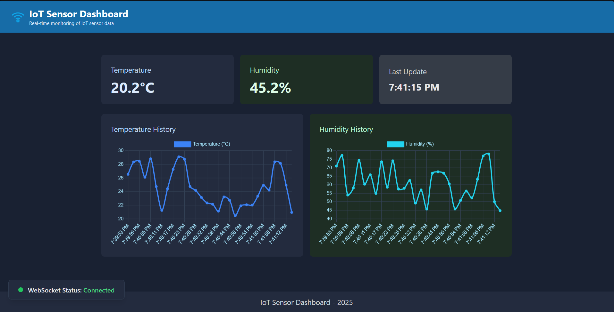
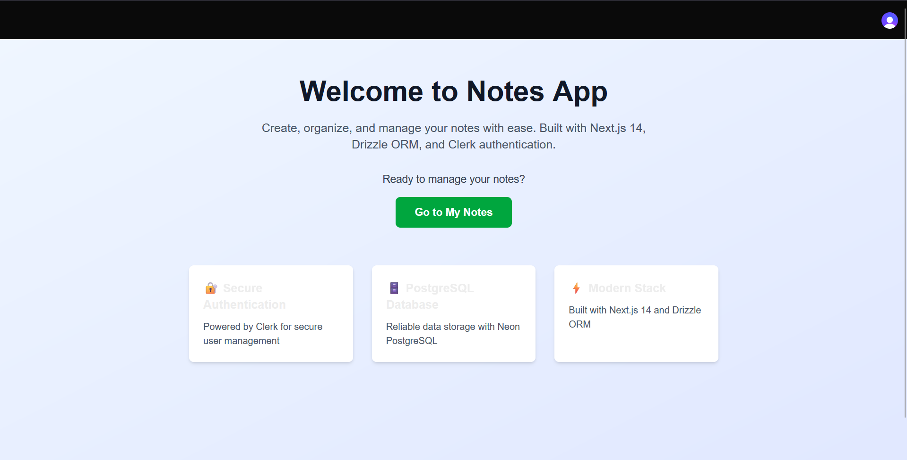
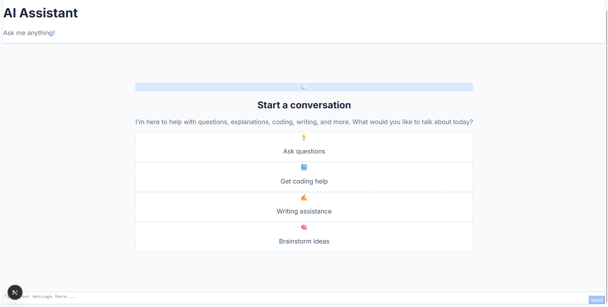
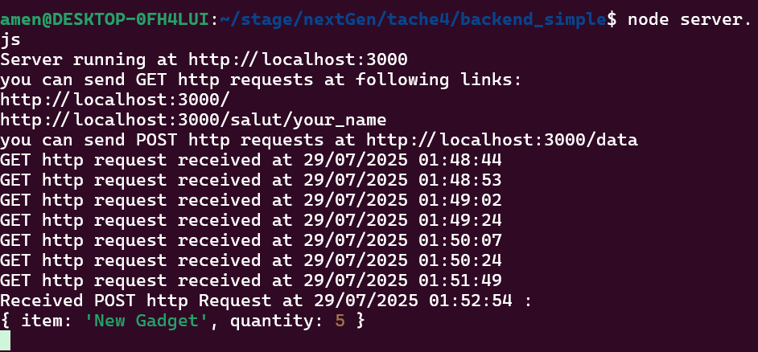
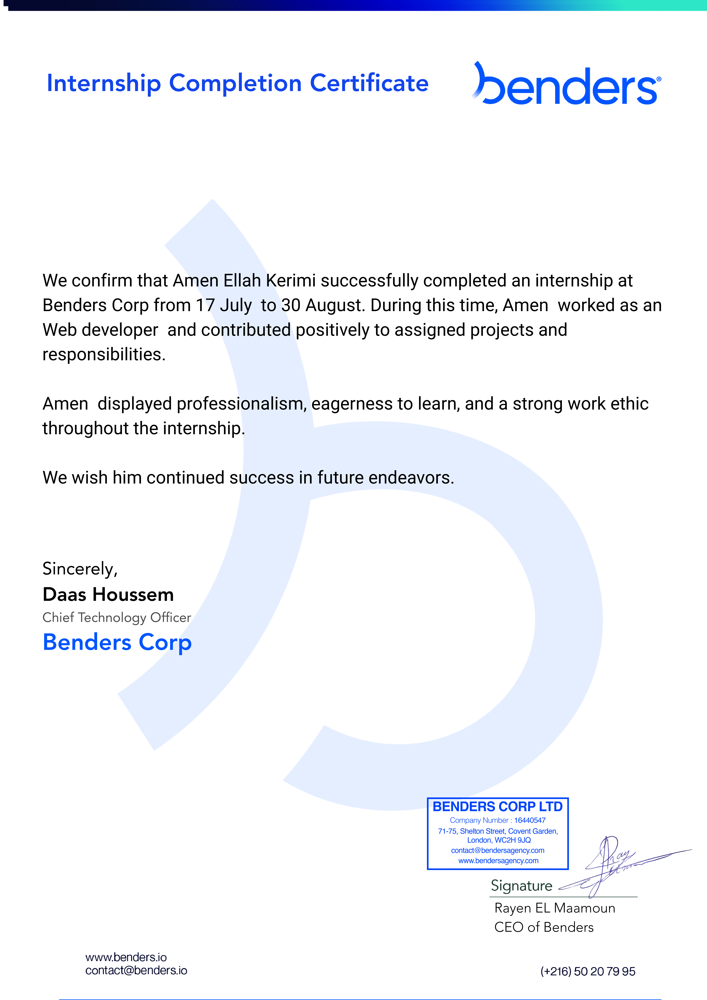

<pre>
    -▬▬.◙.▬▬‐
    ▂▄▄▓▄▄▂
◢◤ █▀▀████▄▄▄◢◤
█▄ █ █▄ ███▀▀▀▀▀▀╬
◥█████◤
══╩══╩══
╬═╬
╬═╬    Hi, I'm Amen Ellah Kerimi
╬═╬    A passionate Computer Engineering Student at the Faculty of Sciences Bizerte. 
╬═╬    I'm driven by a desire to learn and build, constantly creating projects in areas like Cyber Security, AI, Web Development, 
╬═╬    Mobile Development, and IoT to refine my skills and stay consistent. Let's Connect ! 
╬═╬ ☻/
╬═╬/▌
╬═╬/ \
</pre>
## 🌐 Socials:

---

# 💻 Tech Stack & Skills

Here's an overview of the technologies and tools I work with, categorized by field:

### 👨‍💻 Programming Languages
| Category | Languages |
|---|---|
| **Core Languages** |        |

### ⚙️ IoT & Embedded Systems

| Category                   | Technologies                                                                                                                                                                                                                                                                                                                                                                                                                                                                                                                                                                                              |
| -------------------------- | --------------------------------------------------------------------------------------------------------------------------------------------------------------------------------------------------------------------------------------------------------------------------------------------------------------------------------------------------------------------------------------------------------------------------------------------------------------------------------------------------------------------------------------------------------------------------------------------------------- |
| **Hardware Platforms**     |                                                                       |
| **Firmware & RTOS**        |                                       |
| **Sensors & Actuators**    |         |
| **Networking & Protocols** |                                                                                                                                                                           |
| **IoT Security**           |                                                                                                                                                                                                                                                                                     |
| **Robotics & Automation**  |                                                                     |

### 🌐 Web & Mobile Development
| Category | Technologies |
|---|---|
| **Frontend** |        |
| **Backend** |        |
| **Databases** |       |

### 🧠 Artificial Intelligence (AI) & Machine Learning (ML)
| Category | Technologies |
|---|---|
| **Data Analysis & Visualization** |     |
| **Machine Learning & Deep Learning** |     |
| **Embedded AI / Edge AI / TinyML** |   |
| **Computer Vision** |  |

### 🔒 Cybersecurity
| Category                 | Technologies & Concepts                                                                                     |
|--------------------------|-------------------------------------------------------------------------------------------------------------|
| 🔌 Protocols & Networking | TCP/IP, MQTT, TLS/SSL, ARP, DNS, HTTP/S, 802.11 (WiFi), JWT                                                 |
| 🧰 Tools & Platforms      | Nmap, Wireshark, Hydra, Metasploit, Aircrack-ng, Burp Suite, John the Ripper, Cisco Packet Tracer, Mosquitto, Nginx |
| 🧨 Attack Techniques      | ARP Spoofing, Evil Twin, Deauth, Beacon Flood, Probe Request Spam, MQTT Spoofing, Fake Broker/Device Emulation |
| 🛡️ Defensive Practices    | Strong Authentication (JWT, Username/Password), TLS Encryption, Input Validation & Sanitization, Access Control, Message Integrity (Checksums, Hashing), Secure Credential Storage |

<pre>
+-------------------------------------------------------+
|                   CYBERSEC SKILLS                     |
+---------------------------+---------------------------+
|      __________________   | Tools / Skills:           |
|  ==c(______(o(______(_()  | - Nmap                    |
|             )=\           | - Wireshark               |
|            // \\          | - Netcat                  |
|           //   \\         | - ARP/DNS Scanning        |
|          //     \\        | - Beacon / Probe Flood    |
|         // RECON \\       | - Recon Automation Scripts|
|        //         \\      |                           |
+---------------------------+---------------------------+
|                           | Tools / Skills:           |
| |""""""""""""|======[***  | - Metasploit Framework    |
| |  EXPLOIT   \            | - Vulnerability Scanning  |
| |_____________\_______    | - Exploit Chaining        |
| |==[msf >]============\   | - Post-Exploitation Scripts|
| |______________________\  |                           |
| \(@)(@)(@)(@)(@)(@)(@)/   |                           |
|  *********************    |                           |
+---------------------------+---------------------------+
|      o O o                | Tools / Skills:           |
|              o O          | - Custom Shellcodes       |
|                 o         | - Reverse Shells          |
| |^^^^^^^^^^^^^^|l___      | - Meterpreter Payloads    |
| |    PAYLOAD     |""\___, | - Obfuscation Techniques  |
| |________________|__|)__| | - Delivery Methods        |
| |(@)(@)"""**|(@)(@)**|(@) |                           |
|  = = = = = = = = = = = =  |                           |
+---------------------------+---------------------------+
|        \'\/\/\/'/         | Tools / Skills:           |
|         )======(          | - Credential Dumping      |
|       .'  LOOT  '.        | - File / Data Exfiltration|
|      /    _||__   \       | - Token Harvesting        |
|     /    (_||_     \      | - Covering Tracks         |
|    |     __||_)     |     | - Analyzing Stolen Data   |
|    "       ||       "     |                           |
|     '--------------'      |                           |
+---------------------------+---------------------------+
</pre>

### ☁️ DevOps & Cloud
| Category | Technologies |
|---|---|
| **Version Control** |   |
| **Containerization** |   |
| **CI/CD & Automation** |  |

### 📝 Productivity & Other Tools
| Category | Technologies |
|---|---|
| **Productivity** |  |
| **Hardware** |  |
| **Gaming** |  |
---
## 🚀 Projects by Field

### 🧮 Hardware & Embedded Systems

| Project Name                                        | Description                                                                                                                                                                                                                                                                                                                                | Tech                                                                      | Link                                                                                                                 |
| --------------------------------------------------- | ------------------------------------------------------------------------------------------------------------------------------------------------------------------------------------------------------------------------------------------------------------------------------------------------------------------------------------------ | ------------------------------------------------------------------------- | -------------------------------------------------------------------------------------------------------------------- |
| IoT Autonomous Robot                                | Autonomous wheeled robot with articulated arm and custom MPU9250 controller. Deploys TinyML model on ESP32 for real-time control and line-following. ESP32-CAM performs AI object detection (distinguishing tubes for cholesterol vs glucose) and directs the arm to pick-and-place. MQTT handles telemetry and reactive control messages. | ESP32, TinyML, ESP32-CAM, Python, C/C++, MPU9250, MQTT, Edge AI, Robotics | —                                                                                                                    |
| Secure OTA Update System                            | Secure Over-the-Air firmware update system for ESP32 devices. Includes automatic updates via web server, mutual authentication, certificate verification, signature validation, and TLS encryption. Supports version management and server/device cross-validation to ensure safe updates for IoT devices.                                 | ESP32, C/C++, FreeRTOS, HTTPS/TLS, Cryptography, IoT Security             | —                                                                                                                    |
| MQTT Broker System                                  | Custom MQTT broker for secure message passing between IoT devices. Handles multiple clients and topics, designed for testing and managing IoT networks.                                                                                                                                                                                    | ESP32, C/C++, MQTT, Embedded Networking, IoT                              | —                                                                                                                    |
| SECoT Core Firmware                                 | Firmware for SECoT device acting like a Flipper Zero; supports attacks like ARP spoofing, deauth, evil twin, beacon flood, and combinations for IoT security testing.                                                                                                                                                                      | ESP32, C/C++, Embedded Security, Wireless Networks                        | [Repo](https://github.com/Amen-ellah-kerimi/secot-core-firmware)                                                     |
| SECoT Victim Firmware                               | Firmware for IoT victim devices targeted by SECoT attacks; used to demonstrate and test wireless vulnerabilities.                                                                                                                                                                                                                          | ESP32, C/C++, MQTT, Wireless Security                                     | [Repo](https://github.com/Amen-ellah-kerimi/secot-victim-firmware)                                                   |
| Smart Light Firmware                                | Firmware controlling smart lighting devices with networked control, scheduling, and automation.                                                                                                                                                                                                                                            | ESP32, C/C++, MQTT, IoT                                                   | [Repo](https://github.com/Amen-ellah-kerimi/smart-light-firmware)                                                    |
| Weather Station Firmware                            | Firmware managing sensors and data acquisition in weather monitoring IoT devices; integrates with MQTT for real-time streaming and dashboard visualization.                                                                                                                                                                                | ESP32, C/C++, MQTT, Sensors, IoT                                          | [Repo](https://github.com/Amen-ellah-kerimi/weather-station-firmware)                                                |
| Real-Time Face Detection & Recognition (FPGA + CNN) | FPGA-based face detection & recognition using CNN; optimized for real-time performance.                                                                                                                                                                                                                                                    | FPGA, CNN, Python, VHDL                                                   | [Repo](https://github.com/Amen-ellah-kerimi/Real-Time-Face-Detection-and-Recognition-Using-FPGA-and-CNN-Accelerator) |

### 🌐 Full-Stack & Web Development
| Project Name               | Description                                                                                     | Link                                                                                          | Preview |
|----------------------------|-------------------------------------------------------------------------------------------------|-----------------------------------------------------------------------------------------------|---------|
| Web-IOT-Weather-Dashboard  | React frontend + Python Flask backend using MQTT and Chart.js to display weather sensor data.    | [Repo](https://github.com/Amen-ellah-kerimi/Web-IOT-Weather-Dashboard)                       |  |
| amazon-copy                | Amazon e-commerce frontend clone built with React.                                              | [Repo](https://github.com/Amen-ellah-kerimi/amazon-copy)                                      | — |
| Online_Shop_Example        | Example online shop project demonstrating fullstack concepts.                                   | [Repo](https://github.com/Amen-ellah-kerimi/Online_Shop_Example)                              | — |
| Introduction_-_React       | Basic React tutorial project for learning React fundamentals.                                   | [Repo](https://github.com/Amen-ellah-kerimi/Introduction_-_React)                             | — |
| Portfolio-with-Tailwind-CSS| Personal portfolio site using Tailwind CSS.                                                     | [Repo](https://github.com/Amen-ellah-kerimi/Portfolio-with-Tailwind-CSS)                     | — |
| Project-Template           | Boilerplate template project for starting frontend development.                                 | [Repo](https://github.com/Amen-ellah-kerimi/Project-Template)                                  | — |
| Quiz                       | Simple interactive quiz app.                                                                    | [Repo](https://github.com/Amen-ellah-kerimi/Quiz)                                            | — |
| Egg_Timer                  | Timer app implemented in JavaScript.                                                           | [Repo](https://github.com/Amen-ellah-kerimi/Egg_Timer)                                       | — |
| Full Stack App             | Fullstack app with GitHub OAuth authentication, CRUD dashboard, Zod validation, deployment script for Vercel. | [Repo](https://github.com/Amen-ellah-kerimi/fullstack-app)                                    |  |
| Notes App                  | Secure notes app with Clerk authentication, PostgreSQL (Neon), Drizzle ORM, real-time sync.    | [Repo](https://github.com/Amen-ellah-kerimi/notes-app)                                        |  |
| JSON Share App             | JSON editor with public URL sharing via Nanoid, secure read-only sharing system.               | [Repo](https://github.com/Amen-ellah-kerimi/json-share-app)                                   | .png) |
| AI Chat App                | AI assistant with streaming OpenAI GPT responses, modern responsive chat UI.                   | [Repo](https://github.com/Amen-ellah-kerimi/ai-chat-app)                                       |  |

---

### 🧰 Backend & APIs
| Project Name               | Description                                                                                     | Link                                                                                          | Preview |
|----------------------------|-------------------------------------------------------------------------------------------------|-----------------------------------------------------------------------------------------------|---------|
| Express-Rest-API           | RESTful API built with Express.js and Node.js.                                                 | [Repo](https://github.com/Amen-ellah-kerimi/Express-Rest-API)                                  | — |
| Backend-Simple             | Basic backend project with Node.js.                                                            | [Repo](https://github.com/Amen-ellah-kerimi/Backend-Simple)                                    |  |
| MySQL-API                  | API using MySQL database connectivity.                                                        | [Repo](https://github.com/Amen-ellah-kerimi/MySQL-API)                                         | — |

---

### 🧠 Artificial Intelligence & Machine Learning
| Project Name               | Description                                                                                     | Link                                                                                          |
|---------------------------|-------------------------------------------------------------------------------------------------|-----------------------------------------------------------------------------------------------|
| Spam_Classifier           | Spam message classification using Python ML.                                                   | [Repo](https://github.com/Amen-ellah-kerimi/Spam_Classifier)                       |
| FAQs Chatbot (work in progress) | AI chatbot project for FAQs handling (not on GitHub yet).                                    | —                                                                                             |

---

### 🔒 Cybersecurity
| Project Name               | Description                                                                                     | Link                                                                                          |
|---------------------------|-------------------------------------------------------------------------------------------------|-----------------------------------------------------------------------------------------------|
| PFA_SECOT                 | IoT security audit system exploiting MQTT vulnerabilities.                                    | [Repo](https://github.com/Amen-ellah-kerimi/PFA_SECOT)                                 |
| SECoT CLI Tool (Rust)     | CLI tool in Rust interacting with SECoT ESP32 device; supports network scanning and attack simulation. | [Repo](https://github.com/Amen-ellah-kerimi/secot-cli)                                  |
| Simple-Keylogger          | Python keylogger for educational purposes, logs keystrokes to a file.                          | [Repo](https://github.com/Amen-ellah-kerimi/Simple-Keylogger)                    |
| Tool integrations         | Nmap, Hydra, Metasploit, Wireshark, Aircrack-ng, John the Ripper, Burp Suite, Eclipse Mosquitto, OpenSSL (used within projects). | — |

---

### 📱 Mobile Development
| Project Name               | Description                                                                                     | Link                                                                                          |
|---------------------------|-------------------------------------------------------------------------------------------------|-----------------------------------------------------------------------------------------------|
| IMC_Calculator_App        | Flutter app calculating BMI (Body Mass Index).                                                | [Repo](https://github.com/Amen-ellah-kerimi/IMC_Calculator_App)                 |

---

### 🛠️ Developer Tools & Automation

| Project Name | Description | Tech | Link |
|-------------|-------------|------|------|
| GitHub User Activity Tracker | C++ CLI tool fetching and displaying recent GitHub user events. | C++, libcurl, nlohmann/json | [Repo](https://github.com/Amen-ellah-kerimi/github-user-activity-tracker) |
| Internship Applications Automation | Python program that connects to your email, fetches unread internship applications, parses them, and appends structured data to a CSV file. | Python, IMAP, dotenv | [Repo](https://github.com/Amen-ellah-kerimi/Internship-Applications-Automation) |

### 🏴 CTF Participation

| CTF Name          | Highlights & Skills Applied                                      | Proof |
|------------------|------------------------------------------------------------------|-------|
| World Wide CTF 2025 | Solved reverse engineering and protocol analysis challenges in a jeopardy-style event. Focused on binary dissection and logic flaws in simulated IoT firmware. |  |

### 💼 Experience 

| Role                       | Duration                  | Tech Stack                                                                                                                                                                                 | Certificate                                                                    |
| -------------------------- | ------------------------- | ------------------------------------------------------------------------------------------------------------------------------------------------------------------------------------------ | ------------------------------------------------------------------------------ |
| **Web Development Intern** | July 17 – August 30, 2025 | **Frontend:** Next.js, TypeScript, TailwindCSS **Backend:** Node.js, Prisma ORM, PostgreSQL **Auth/Security:** Clerk **Deployment/DevOps:** Docker Compose, Vercel **Code Quality:** ESLint |  |

